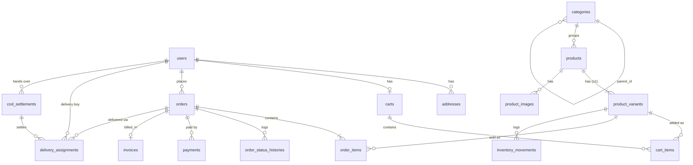

# Database Design (DRAFT, for review)

> Status: **draft**. No migrations are written until Phase 4. Items marked ❓ depend on
> [client-questions.md](client-questions.md).
> Conventions: `id` bigint PK, `timestamps()` on all tables, money as `*_paise` unsigned bigint,
> statuses as string columns backed by PHP enums, foreign keys with explicit `onDelete` rules.

## Entity overview

## Tables

### users
| Column | Type | Notes |
|---|---|---|
| name | string | |
| email | string, unique | From Google for customers |
| email_verified_at | timestamp null | |
| google_id | string null, unique | Customers only |
| avatar_url | string null | |
| phone | string(15) null, index | Required before a customer's first order. Login ID for delivery boys ❓ |
| password | string null | Null for Google-only customers |
| role | string | `customer` \| `admin` \| `delivery` (enum `UserRole`) |
| is_active | boolean, default true | Inactive users cannot log in |
| last_login_at | timestamp null | |
| remember_token | | |
| *(Filament MFA columns)* | | Added by Filament in Phase 7 |

### addresses
`user_id` FK (cascade), `label` (Home/Work), `recipient_name`, `phone`, `line1`, `line2` null, `landmark` null,
`city`, `state`, `pincode` (char 6, index), `is_default` bool, `latitude/longitude` decimal null (future),
soft deletes.

### categories
`parent_id` FK null (self), `name`, `slug` unique, `description` null, `image_path` null, `sort_order` int,
`is_active` bool.

### products
`category_id` FK (restrict), `name`, `slug` unique, `brand` null, `short_description` null,
`description` text null, `is_active` bool, `is_featured` bool, `hsn_code` null ❓, `tax_rate_bp` null ❓
(basis points), soft deletes. Fulltext index on (`name`, `brand`) for search.

### product_variants
**Every product has at least one variant**, so simple and variant products are handled the same way ❓.
`product_id` FK (cascade), `sku` unique, `name` (e.g. "Default", "Shade 02", "500 g"), `mrp_paise`,
`price_paise` (selling price, discount = mrp − price), `stock_quantity` unsigned int,
`low_stock_threshold` unsigned int default 5, `weight_grams` null, `is_active` bool, `sort_order`.

### price_slabs (wholesale, ADR-019)
`product_variant_id` FK (cascade), `min_quantity` unsigned int, `unit_price_paise`, `is_active` bool,
unique(`product_variant_id`, `min_quantity`). Slabs are read in ascending `min_quantity`; the smallest is the
product's minimum wholesale quantity. A variant with no rows is retail-only. A line at or above the minimum is
priced at the matching slab, both in the cart and when the order is placed.

### wholesale_enquiries (optional quote requests, ADR-019)
`reference` unique (e.g. `WQ-5101`), `user_id` FK null, `business_name`, `contact_name`, `phone`, `email` null,
`gstin` null, `business_type`, `city`, `pincode`, `needed_by` date null, `message`, `status`
(`new` | `quoted` | `won` | `lost`), `handled_by` FK users null, `items` json null (the bag the customer
attached: sku, name, quantity, unit price), `estimate_paise` null.

### product_images
`product_id` FK (cascade), `product_variant_id` FK null, `path`, `alt` null, `sort_order`.

### carts / cart_items
`carts`: `user_id` FK null unique, `session_id` null index (guest cart, merged when the customer signs in).
`cart_items`: `cart_id` FK (cascade), `product_variant_id` FK (cascade), `quantity`, unique(cart_id, variant_id).
Prices are **not** stored in the cart. They are always read live and copied only into the order.

### orders
| Column | Notes |
|---|---|
| order_number | unique, e.g. `ORD-10245` |
| user_id | FK (restrict) |
| status | `OrderStatus` |
| payment_method | `cod` \| `upi` |
| payment_status | `PaymentStatus` |
| ship_name, ship_phone, ship_line1, ship_line2, ship_landmark, ship_city, ship_state, ship_pincode | address snapshot |
| subtotal_paise, discount_paise, delivery_charge_paise, total_paise | |
| customer_note | null |
| cancel_reason | null |
| placed_at, confirmed_at, packed_at, delivered_at, cancelled_at | timestamps null |

Indexes: (`status`, `created_at`), (`payment_status`), (`user_id`, `created_at`).

### order_items
`order_id` FK (cascade), `product_id` FK null (set null), `product_variant_id` FK null (set null),
snapshot: `product_name`, `variant_name`, `sku`, `mrp_paise`, `unit_price_paise`, `quantity`,
`line_total_paise`, `is_wholesale` bool (the line was priced at a slab, ADR-019), `tax_rate_bp` null ❓,
`hsn_code` null ❓.

### order_packages (ADR-021)
`order_id` FK (cascade), `package_id` unique (e.g. `PKG-10245-1`), `sequence` (1-based, with
`order_packages_count` giving "Box 1 of 2"), `pickup_code_hash` (6 digits, hashed, printed on the label),
`picked_up_at` null, `picked_up_by` FK users null, `weight_grams` null, `returned_at` null.
`order_package_items`: `order_package_id` FK (cascade), `order_item_id` FK (cascade), `quantity` — which items
went into which box, so each label lists its own contents.
An order is `out_for_delivery` only when every package has `picked_up_at`.

### delivery_assignments (ADR-020, ADR-021)
`order_id` FK (cascade), `user_id` FK (the delivery boy, restrict), `step` (`DeliveryStep`),
`assigned_by` FK users null, `assigned_at`, `accepted_at` null, `picked_up_at` null, `reached_at` null,
`delivered_at` null, `failed_at` null, `failure_reason` (`DeliveryFailureReason`) null, `failure_note` null,
`otp_hash` (the customer's 6-digit delivery OTP, hashed), `otp_attempts` unsigned tiny int default 0,
`pickup_attempts` unsigned tiny int default 0,
`cash_collected_paise` unsigned int default 0, `cod_settlement_id` FK null.
Indexes: (`user_id`, `step`), (`order_id`). Only the milestones write to `orders.status`: picked up →
`out_for_delivery`, delivered → `delivered`, failed → `delivery_failed`.

### order_status_histories
`order_id` FK (cascade), `from_status` null, `to_status`, `changed_by` FK users null, `note` null,
`created_at`. Rows are only ever added, never edited.

### payments
One order can have several payment attempts (e.g. UPI proof rejected, then re-uploaded) ❓.
`order_id` FK, `method`, `amount_paise`, `status` (`submitted` \| `verified` \| `rejected`),
`utr` string(22) null **unique**, `proof_path` null (private disk), `submitted_at`,
`verified_by` FK users null, `verified_at` null, `rejection_reason` null.

### inventory_movements
`product_variant_id` FK, `order_id` FK null, `user_id` FK null, `type`
(`sale` \| `cancel_restore` \| `restock` \| `adjustment`), `quantity_change` (signed int), `stock_after`,
`note` null, `created_at`. Rows are only ever added.

### invoices
`order_id` FK unique, `invoice_number` unique (sequential per financial year, e.g. `INV/2026-27/00001`) ❓,
`issued_at`, `pdf_path` null, snapshot of totals (and GST breakup ❓). Not editable once issued.

### delivery_assignments
| Column | Notes |
|---|---|
| order_id | FK |
| delivery_user_id | FK users (role = delivery) |
| assigned_by | FK users |
| status | `DeliveryStatus`: assigned, accepted, picked_up, out_for_delivery, reached, delivered, failed, reassigned |
| assigned_at, accepted_at, picked_up_at, out_for_delivery_at, reached_at, delivered_at | timestamps null |
| failure_reason | null ❓ |
| otp_hash, otp_expires_at, otp_attempts | OTP stored hashed. Max 5 attempts |
| cod_collected_paise, cod_collected_at | null |
| cod_settlement_id | FK null |

Only one *active* assignment per order (enforced in the Action). Earlier ones are kept as `reassigned` / `failed`.

### cod_settlements ❓
`delivery_user_id` FK, `amount_paise`, `received_by` FK users, `received_at`, `note`.

### settings
Key/value store for admin-editable system settings (exact storage decided in Phase 4, see ADR-013).
Read only through `App\Support\ShopSettings`, cached, with `config/shop.php` as the fallback.

| Key | Example | Notes |
|---|---|---|
| `shop.name` | "Demo Gift Store" (demo) | Shown everywhere. Never hardcoded |
| `shop.tagline` | | Optional |
| `shop.logo_path` | | Public disk |
| `shop.phone`, `shop.whatsapp`, `shop.email` | | Header/footer, invoice, label |
| `shop.address` | | Invoice, label, footer |
| `shop.gstin` ❓ | | Invoice |
| `payment.upi_vpa`, `payment.upi_payee_name` | | UPI QR |
| `print.label_format` | `thermal_4x6` \| `a5` \| `a4` | ADR-014 |
| `print.invoice_format` | `a4` \| `a5` | ADR-014 |
| `delivery.charge_rules`, `delivery.pincodes` ❓ | | Checkout |

### Package / framework tables
`sessions`, `cache`, `jobs`, `failed_jobs`, `password_reset_tokens` (Laravel), `activity_log`
(spatie/laravel-activitylog, Phase 6+), Filament notifications if used.

## Status machines

### OrderStatus
| From | Allowed to |
|---|---|
| `placed` | `confirmed`, `cancelled` |
| `confirmed` | `packing`, `cancelled` |
| `packing` | `packed`, `cancelled` |
| `packed` | `assigned`, `cancelled` |
| `assigned` | `out_for_delivery`, `packed` (unassigned), `cancelled` |
| `out_for_delivery` | `delivered`, `delivery_failed` |
| `delivery_failed` | `assigned` (reattempt), `cancelled` (returned to shop) ❓ |
| `delivered`, `cancelled` | — (final) |

Rules: a UPI order can move `placed → confirmed` only when `payment_status = verified`.
Moving to `cancelled` restores stock (logged in `inventory_movements`).

### PaymentStatus
| Value | Meaning |
|---|---|
| `cod_pending` | COD order, cash not yet collected |
| `cod_collected` | Delivery boy recorded cash |
| `awaiting_proof` | UPI chosen, no proof uploaded yet |
| `pending_verification` | Proof + UTR submitted |
| `verified` | Admin approved |
| `rejected` | Admin rejected (customer may re-upload ❓) |
| `refunded` | Future |

### DeliveryStatus
`assigned → accepted → picked_up → out_for_delivery → reached → delivered`,
plus `failed` (from picked_up / out_for_delivery / reached) and `reassigned` (from assigned / accepted).
